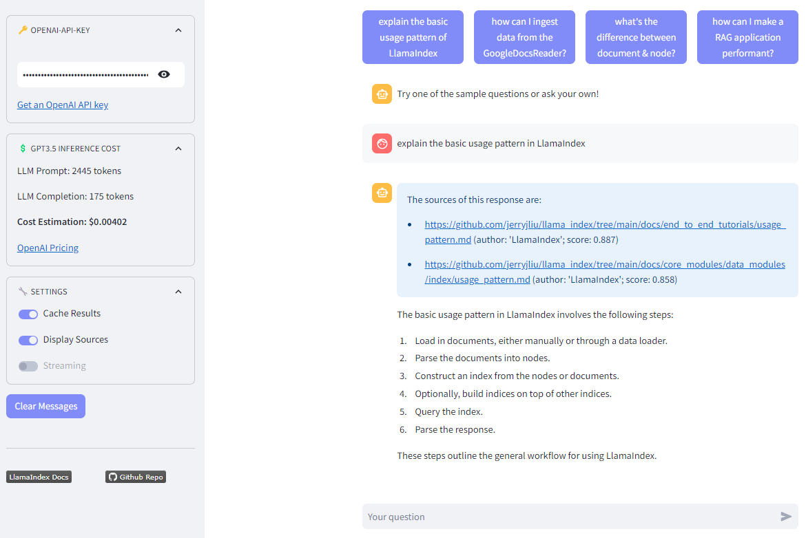

[](https://llamaindexchat.streamlit.app/)
[](https://www.python.org/)
[](https://www.codefactor.io/repository/github/dcarpintero/llamaindexchat)
[](https://github.com/dcarpintero/st-newsapi-connector/blob/main/LICENSE)

# Chat with 🦙 LlamaIndex Docs 🗂️

<p align="center">
  
</p>

Chatbot App using [LlamaIndex](https://www.llamaindex.ai/) to augment OpenAI GPT-3.5 with the [LlamaIndex Documentation](https://gpt-index.readthedocs.io/en/latest/index.html). Works with Streamlit >= 1.26. 

## 🦙 What's LlamaIndex?

> *LlamaIndex is a simple, flexible data framework for connecting custom data sources to large language models. [...] It helps in preparing a knowledge base by ingesting data from different sources and formats using data connectors. The data is then represented as documents and nodes, where a node is the atomic unit of data in LlamaIndex. Once the data is ingested, LlamaIndex indexes the data into a format that is easy to retrieve. It uses different indexes such as the VectorStoreIndex, Summary Index, Tree Index, and Keyword Table Index. In the querying stage, LlamaIndex retrieves the most relevant context given a user query and synthesizes a response using a response synthesizer. [Response from our Chatbot to the query 'What's LlamaIndex?']*

## 📋 How does it work?

LlamaIndex enriches Large Language Models (GPT-3.5 in our case) with a custom knowledge base through a process called [Retrieval Augmented Generation (RAG)](https://research.ibm.com/blog/retrieval-augmented-generation-RAG):

- **Connect to a External Datasource**: We use the [Github Repository Loader](https://llamahub.ai/l/github_repo) available at [LlamaHub](https://llamahub.ai/) (an open-source repository for data loaders) to connect to the Github repository containing the markdown files of the LlamaIndex Docs.

```python
def initialize_github_loader(github_token: str) -> GithubRepositoryReader:
    """Initialize GithubRepositoryReader"""	

    download_loader("GithubRepositoryReader")
    github_client = GithubClient(github_token)

    loader = GithubRepositoryReader(github_client, [...])

    return loader
```

- **Construct Documents**: The markdown files are ingested and automatically converted to Document objects. In addition, we add the dictionary {'filename': '', 'author': ''} to the metadata of each document (which will be inhereited by the nodes). This will allow us to retrieve and display the data sources and scores in the chatbot responses to make our App more transparent:

```python
def load_and_index_data(loader: GithubRepositoryReader) -> :
    """Load Knowledge Base from GitHub Repository"""

    logging.info("Loading data from Github: %s/%s", loader._owner, loader._repo)
    docs = loader.load_data(branch="main")
    for doc in docs:
        doc.metadata = {'filename': doc.extra_info['file_name'], 'author': "LlamaIndex"}
        
    return docs
```

- **Parse Nodes**: Nodes represent a *chunk* of a source Document, we have define a chunk size of '1024' with an overlap of '32'. Similar to Documents, Nodes contain metadata and relationship information with other nodes.
```python
    [...]

    logging.info("Parsing documents into nodes...")
    parser = SimpleNodeParser.from_defaults(chunk_size=1024, chunk_overlap=32)
    nodes = parser.get_nodes_from_documents(docs)
```

- **Indexing**: An Index is a data structure that allows us to quickly retrieve relevant context for a user query. For LlamaIndex, it's the core foundation for retrieval-augmented generation (RAG) use-cases. LlamaIndex provides different types of indices, such as the [VectorStoreIndex](https://gpt-index.readthedocs.io/en/latest/core_modules/data_modules/index/index_guide.html), which make LLM (Language Model) calls to compute embeddings for each Node:

```python
    [...]

    logging.info("Indexing nodes...")
    index = VectorStoreIndex(nodes)

    logging.info("Persisting index on ./storage...")
    index.storage_context.persist(persist_dir="./storage")
        
    logging.info("Data-Knowledge ingestion process is completed (OK)")

    return index
```

- **Querying (with cache)**: Once the index is constructed, querying a vector store index involves fetching the top-k most similar Nodes (by default 2), and passing those into the Response Synthesis module. We rely on the [Streamlit caching mechanism](https://docs.streamlit.io/library/advanced-features/caching) to optimize the performance.

```python
@st.cache_data(max_entries=1024, show_spinner=False)
def query_chatengine_cache(prompt, _chat_engine, settings):
    return _chat_engine.chat(prompt)
```

- **Parsing Response**: After querying the index, the app parses the response source nodes to extract the filenames and the scores of the top-k similar Nodes (from which the answer was retrieved):

```python
def parse(response):
    sources = []
    for item in response.source_nodes:
        if hasattr(item, "metadata"):
            filename = item.metadata.get('filename')
            score = float("{:.3f}".format(item.score))
            sources.append({'filename': filename, 'score': score})
    
    return sources
```

- **Estimating Inference Cost**: By updating the [Session State](https://docs.streamlit.io/library/api-reference/session-state) variable 'token_counter' after each response, the app tracks the number of token outputs and estimates the overall [GTP-3.5 costs](https://openai.com/pricing). 

```python
def update_token_counter(response):
    # 1,000 tokens is about 750 words
    st.session_state['token_counter'] += round( 0.75 * len(response) )
```


## 🚀 Quickstart

1. Clone the repository:
```
git clone git@github.com:dcarpintero/chatwithweb3.git
```

2. Create and Activate a Virtual Environment:

```
Windows:

py -m venv .venv
.venv\scripts\activate

macOS/Linux

python3 -m venv .venv
source .venv/bin/activate
```

3. Install dependencies:

```
pip install -r requirements.txt
```

4. Ingest Knowledge Base
```
python ingest_knowledge.py
```

5. Launch Web Application

```
streamlit run ./app.py
```

## 👩‍💻 Streamlit Web App

Demo Web App deployed to [Streamlit Cloud](https://streamlit.io/cloud) and available at https://llamaindexchat.streamlit.app/ 

## 📚 References

- [LLamaIndex Doc Reference](https://gpt-index.readthedocs.io/en/latest/index.html)
- [Get Started with Streamlit Cloud](https://docs.streamlit.io/streamlit-community-cloud/get-started)